# 医院管理系统设计报告

## 第 1 章 绪论

### 1.1 项目背景

随着计算机科学的迅猛发展和互联网技术的不断推进，人们的生活方式发生了巨大的变化，同时也推动了整个软件产业的发展。把传统产业服务和计算机科学结合起来，已成为一种大趋势。在传统的医院看病，病人需要办理繁杂的手续和填写众多资料，这种操作极其不友好。在一些情况下，医生需要手写病历，不清楚病人的病史，治疗效果可能不佳。随着医院改革的不断深入，一套可以提升医院工作效率、减少医疗差错、给患者提供便捷服务的软件急需出现。我国医院信息管理系统的发展形式十分令人鼓舞，无论是国家、医院还是软件公司，都投入了大量的人力、物力、财力。大中型医院都有自己的医院管理系统，这说明医院本身在对 HIS 建设的认识都有了很大的提高。因此，开发一套管理医院信息，方便患者看病，方便医生诊断的系统是非常有必要的。

### 1.2 任务分解

本课题根据前期的问卷调查以及实地考察，作出了适合实际的需求分析，采用了前后端分离的思想，后端使用了 SpringBoot 和 SpringMVC 框架，前端使用了 Vue.js 和 ElementUI 进行页面的搭建，并且使用了 MySQL 数据库进行数据交互。整个系统的使用者有三种角色，分别是医院管理员、患者以及医生。

以下是三种不同的角色所分别拥有的功能：

  * **管理员** ：可对医生信息，患者信息，挂号信息，药物信息，检查项目信息进行增删改查操作，可根据日期对医生进行排班操作，同时还可以查看数据的统计信息。
  * **患者** ：可以预约当天以及往后七天的挂号，可以自助缴费，完成治疗后可浏览并打印病情报告单，同时也可对就诊医生进行评分。
  * **医生** ：根据患者的挂号，可以诊断病因并开处方药以及检查项目，同时还有追加诊断功能，可以根据病人的病情需要申请当天入院。

### 1.3 设计报告章节分布

本文主要设计和实现一个基于 JavaEE 的医院管理系统。

以下罗列出了本论文的章节安排：

  * **第 1 章 绪论** ：简明扼要地介绍了本课题的研究背景和意义，阐明了课题的主要任务，最后陈列出了本论文的章节安排。
  * **第 2 章 相关技术和开发环境** ：本章介绍了系统用到的相关技术和开发环境。
  * **第 3 章 系统分析** ：从经济、技术、运行三个方面介绍了系统可行性，从业务、功能、数据以及数据操作四个方面介绍了系统需求分析。
  * **第 4 章 概要设计** ：介绍了本系统的设计，包括架构、功能、数据库以及接口的设计。
  * **第 5 章 详细设计** ：对系统的主要功能以及数据库的设计进行了详细介绍。
  * **第 6 章 系统实现** ：展示了系统的主要功能界面，并对其操作进行说明。
  * **第 7 章 系统测试** ：简要介绍了系统的测试方法和测试环境，编写了主要测试用例，并分析记录了测试结果。
  * **第 8 章 总结与展望** ：对本次的课题设计进行了总结，展望该系统仍需完善的功能。

## 第 2 章 相关技术和开发环境

### 2.1 相关技术

本课题在 Windows 系统下使用了 JavaEE 开发技术、Spring Boot 技术、Vue.js 技术、Tomcat 服务器、Redis 无关系型数据库、MySQL 关系型数据库以及 ElementUI 前端框架技术进行开发。以下是关键技术及开发工具介绍。

#### Java 语言

Java 是一种面向对象的编程语言，由 Sun Microsystems（现在是 Oracle 公司）于 1995 年首次发布。它具有可移植性、安全性和跨平台等特性，因此被广泛应用于各个领域的软件开发中。

Java 的平台无关性是其最重要的特性之一。通过 Java 虚拟机（JVM），Java 程序可以在不同的操作系统和硬件上运行，而不需要针对特定平台进行修改。这意味着一次编写的 Java 代码可以在 Windows、Linux、Mac 等多个平台上运行。

Java 是一种面向对象的语言，它支持封装、继承和多态等面向对象的编程概念。这使得 Java 程序更易于理解、扩展和维护。它还提供了强大的异常处理机制，使开发者能够更好地应对错误和异常情况。

Java 还具有丰富的标准库和第三方库，以及一个庞大的开发者社区。这些库提供了许多常用的功能和工具，使得 Java 的开发变得更加高效和便捷。

#### HTML、CSS、JavaScript

HTML（超文本标记语言）是一种用于创建和组织网页内容的标记语言。它由一系列标签组成，标签用于标记和描述文档中的不同部分，如标题、段落、链接和图像等。HTML 提供了结构化的标记方式，使得浏览器能够正确地解析并显示网页内容。

CSS（层叠样式表）是一种用于描述网页外观和布局的样式语言。通过 CSS，可以对 HTML 文档中的元素进行样式设置，包括字体、颜色、大小、间距、边框和背景等。CSS 的设计目标是将样式与内容分离，使得网页的样式可以独立于内容进行修改和调整，从而提高网页的可维护性和灵活性。

JavaScript 是一种动态的、基于对象和事件驱动的脚本语言。它广泛用于前端开发，用于为网页增加交互性和动态性。通过 JavaScript，可以操作网页的元素、处理用户的输入、响应事件、进行表单验证和数据处理等。它还可以通过 AJAX 技术与服务器进行数据交互，实现动态加载内容和实时更新。

HTML、CSS 和 JavaScript 三者通常一起使用，被称为前端开发技术。HTML 负责网页的内容和结构，CSS 负责网页的样式和布局，JavaScript 负责网页的交互和动态效果。它们共同作用于网页的不同方面，使网页成为一个功能丰富、外观吸引人且易于使用的用户界面。

总结起来，HTML 提供了网页内容的结构和标记，CSS 负责网页的样式和布局，JavaScript 为网页增加了交互性和动态功能。三者的协同工作使得构建现代化、交互式的网页成为可能。

#### Redis

Redis 是一个开源的使用 ANSI C 语言编写、支持网络、可基于内存亦可持久化的日志型、Key - Value 数据库，并提供多种语言的 API。Redis 的主要优点如下：

  * 支持多种数据类型，包括 Set，Zset，List，Hash，String 五种数据类型，操作方便，适用于众多业务场景。
  * 持久化存储，可以将内存中的数据保存在磁盘中，重启的时候可以再次加载进行使用。
  * 性能好，Redis 是基于内存操作的，所以读写性能很好。Redis 读的速度是 110000 次 / s，写的速度是 81000 次 / s。
  * 丰富的特性，Redis 支持 Publish/Subscribe，通知，Key 过期策略等特性。

#### MySQL

MySQL 是一种关系型数据库管理系统，是一个多用户，多线程的 SQL 数据库。MySQL 的优点是体积小、速度快、总体拥有成本低，开放源代码等，使得它成为了目前中小企业的最爱。

#### SSM 框架

SSM 框架是由 Spring，SpringMVC 和 MyBatis 三个开源框架整合而成，是当前较为流行稳定的 Web 项目框架。

  * Spring 是一个开源框架，它是为了解决企业应用开发的复杂性而创建的。Spring 的核心是控制反转和面向切面编程。
  * SpringMVC 是 Spring 框架的组成部分之一，MVC 框架提供了模型 - 视图 - 控制的体系结构和可以用来开发灵活、松散耦合的 Web 应用程序的组件。
  * MyBatis 是一个基于 Java 的持久层框架，它支持定制化 SQL、存储过程以及高级映射。该框架解除了 SQL 与程序代码的耦合，提高了代码的可维护性。同时，MyBatis 较为灵活，简单易学以及支持动态 SQL 语句等优点，让它深受广大编程人员的喜爱。

#### Vue.js

Vue.js 是一套用于构建用户界面的渐进式框架。与其它大型框架不同的是，Vue 被设计为可以自底向上逐层应用。Vue 的核心库只关注视图层，不仅易于上手，还便于与第三方库或既有项目整合。

#### SpringBoot

SpringBoot 是由 Pivotal 团队提供的全新框架，其设计目的是用来简化新 Spring 应用的初始搭建以及开发过程。使用 SpringBoot 的最大好处就是简化配置，它实现了自动化配置。

### 2.2 开发环境

表 2 - 1 展示了系统所需的开发环境。

表 2-1 系统所需开发环境表

操作系统| Windows 10/11
---|---
开发工具| IntelliJ IDEA 2024.1
Java 环境| JDK1.8，Maven 3.8.1
数据库| MySQL 8.0.19、Redis 3.0.10
服务器| Tomcat 9.0.30

## 第 3 章 系统分析

### 3.1 可行性分析

#### 3.1.1 经济可行性

本系统为本科毕业设计，未真正投入到实际生活中，所需要的硬件设备目前只需用到一部电脑，软件方面大部分为官方提高免费使用的，所需资料也可在网上或者查询相关书籍即可找到。因此，本系统开发在经济方面是可行的。

#### 3.1.2 技术可行性

本系统的主要开发语言为 Java，基于目前较为流行的 SpringBoot 以及 Vue.js 框架进行编写。本系统采用了 MySQL 数据库作为数据存储基础阵地，保证了一个安全、稳定的数据使用环境。本系统使用的技术，基本上都是目前较为流行的并且是开源的技术，文档和资料在互联网上都非常健全，且有许多开发成功的项目。因此，本系统开发在技术方面是可行的。

#### 3.1.3 运行可行性

本系统基于 SpringBoot 框架，需要搭建 Java，Maven，Redis，MySQL 等软件环境。在搭建的过程中，有遇到的问题，但通过查询资料解决。

### 3.2 业务流程分析

#### 3.2.1 业务流程分析

本系统的使用者一共有管理员、医生和患者这三种角色：

  * **管理员** ：首页展示当天的预约挂号人数和住院人数，可对医生信息进行查增、批量导入和批量导出，可对患者、挂号信息进行查删，可对药物、检查项目和病床信息进行增删改查，可对医生进行排班操作，可查看数据统计页面。
  * **医生** ：首页展示当天本人的预约挂号人数，可对患者进行诊断、开处方药、开检查项目以及追诊操作，可帮患者申请入院，可查看本人诊断的挂号信息。
  * **患者** ：可预约挂号，可查看本人挂号信息，可查看本人住院信息，可对医生进行评价。

本系统的业务需求主要是对信息的基本管理、预约挂号和处理挂号等。

主要业务需求表 3 - 1：

表 3-1 业务需求表

编号| 业务名称| 操作者
---|---|---
1| 医生信息管理| 管理员
2| 患者信息管理| 管理员
3| 挂号信息管理| 管理员
4| 药物信息管理| 管理员
5| 检查项目信息管理| 管理员
6| 病床信息管理| 管理员
7| 值班安排功能| 管理员
8| 数据分析功能| 管理员
9| 预约挂号功能| 患者
10| 查看报告单功能| 患者
11| 查看住院信息功能| 患者
12| 诊断功能| 医生
13| 申请住院功能| 医生

#### 3.2.2 数据流程图和逻辑流程图

总体业务流程图如下：

图 3-1 管理员查询数据通用流程图

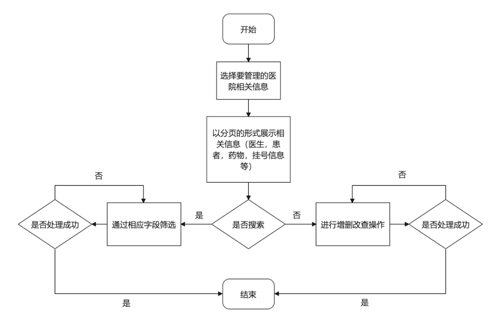

图 3-2 医生查询和操作数据通用流程图

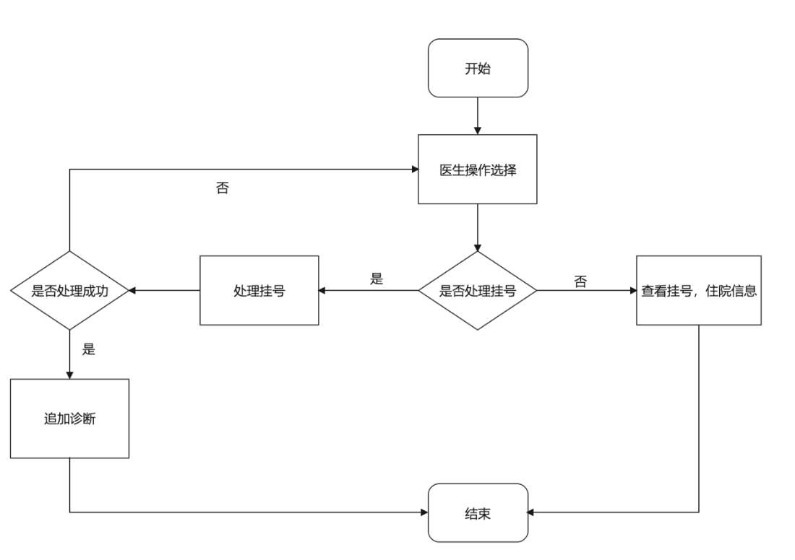

图 3-3 患者查询和操作数据通用流程图

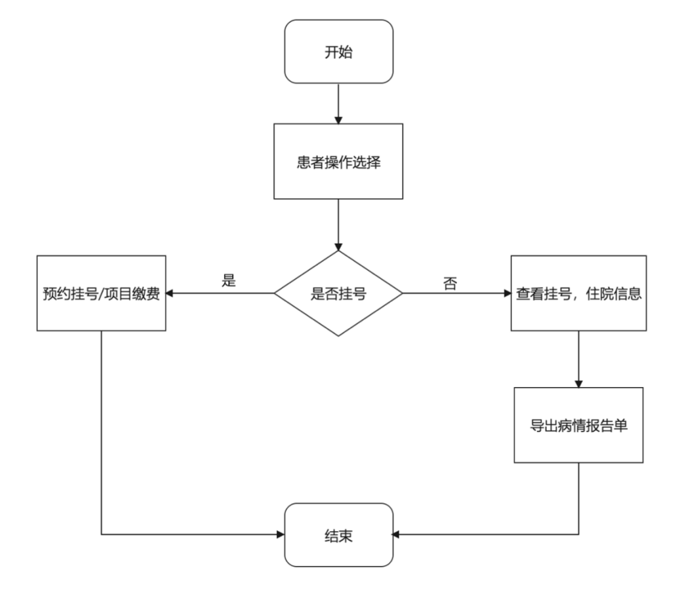

预约挂号功能：先选择科室，会显示出该科室的所有医生信息，选择挂号日期，会显示出该天值班的医生。患者可以选择医生进行挂号，点击挂号操作后，会要求你选择时间段，同时会显示出该时间段所剩的号源，若无剩余号源，挂号失败，否则成功。

[图片：图 3-4 患者预约挂号流程图]

医生处理挂号功能：医生按照顺序处理挂号信息，根据患者描述的症状填写相关信息，并且可以开处方药和开检查项目。患者检查完相应项目，可拿着报告单再次向医生寻求诊断，医生可以根据报告单填写病因和开处方药。

[图片：图 3-5 医生处理挂号流程图]

### 3.3 用例图分析

根据本系统的使用者将用户划分为三种角色，分别是医院管理员，医生和患者。进入系统前需要通过账号以及密码进行登录，患者若无账号可先注册，医生的账号由管理员统一注册，登录成功后则根据他们的各自的角色进入相应的页面。

[图片：图 3-6 用户关系用例图]
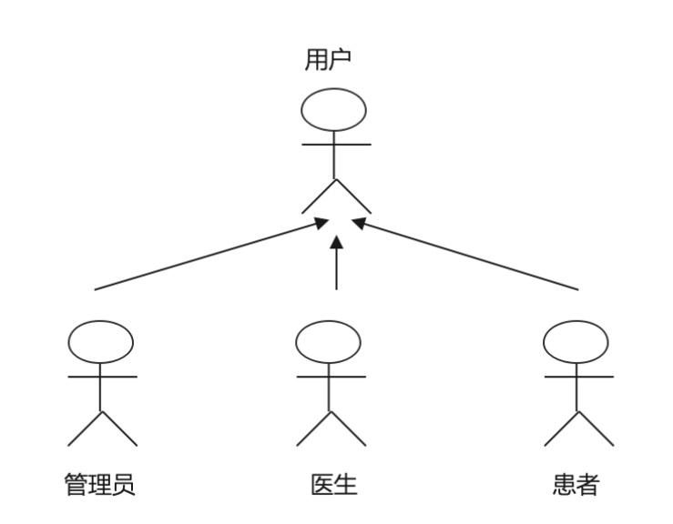

医院管理员进入网站的页面后，可以进行的功能用例如下：

[图片：图 3-7 管理员用例图]
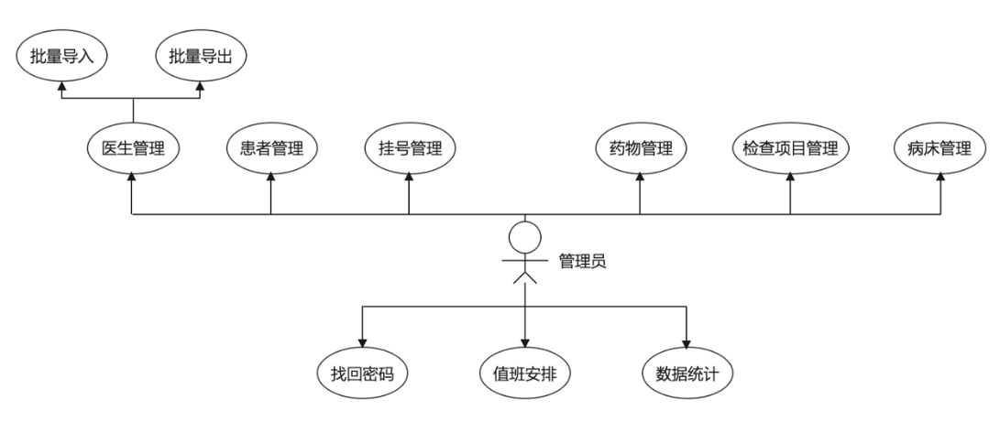

  * 医生管理：可以通过关键字搜索，分页展示医生信息，同时可以增加、删除、修改医生信息，支持批量导入、批量导出医生信息。
  * 患者管理：可以通过关键字搜索，分页展示患者信息，同时也可以删除患者信息。
  * 挂号管理：可以通过关键字搜索，分页展示挂号信息，也可以删除挂号信息。
  * 药物管理：可以通过关键字搜索，分页展示药物信息，同时可以增加、删除、修改药物信息。
  * 检查项目管理：可以通过关键字搜索，分页展示检查项目信息，同时可以增加、删除、修改项目信息。
  * 病床管理：可以通过关键字搜索，分页展示病床信息，同时可以增加、修改、清空病床信息。
  * 找回密码：支持管理员通过邮件修改密码。
  * 值班安排：可选择从今往后一个月的任一天时间，对医生进行排班。
  * 数据统计：管理员可查看挂号、患者等的数据统计信息。

医生进入网站的页面后，可以进行的功能用例如下：

[图片：图 3-8 医生用例图]
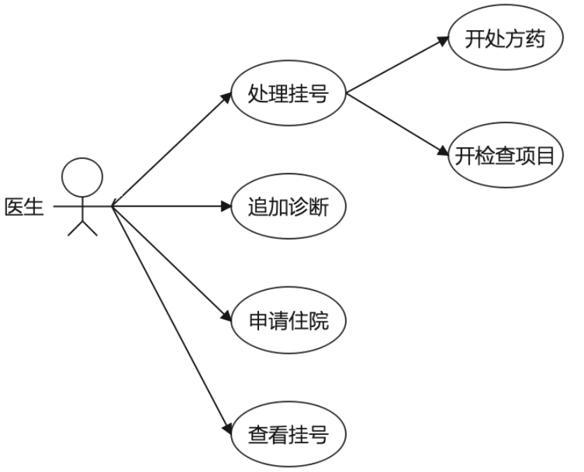

  * 处理挂号：医生可根据病人的描述，填写症状，还可开处方药和开检查项目。
  * 追加诊断：该功能针对完成检查项目的患者，医生可根据检查报告单填写病因及建议，也可开处方药。
  * 申请住院：医生可根据患者的病情申请住院。
  * 查看挂号：医生可查看所处理患者的挂号信息，包括缴费信息等。

患者进入网站的页面后，可以进行的功能用例如下：

[图片：图 3-9 患者用例图]
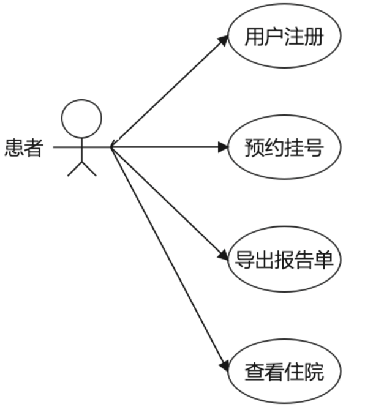

  * 用户注册：支持新用户注册功能。
  * 预约挂号：患者可以选择科室，选择时间段，选择医生进行预约挂号。
  * 导出报告单：患者可以查看病情报告，并可自助打印病情报告单。
  * 查看住院：患者可通过此功能查看本人的住院信息。

### 3.4 数据需求分析

#### 3.4.1 实体集分析

实体集是具有相同类型及相同属性的实体的集合。本系统主要的实体集主要有：管理员信息，医生信息，患者信息，值班信息，药物信息，病床信息，检查项目信息，挂号信息等。

#### 3.4.2 实体集数据项分析

  * **管理员信息** ：管理员 ID，密码，姓名，性别，身份证号码，手机号，邮箱。
  * **医生信息** ：医生 ID，密码，姓名，性别，身份证号码，手机号，邮箱，职位，个人简介，所处科室，在职状态，挂号费用，评分人数，总分，平均分。
  * **患者信息** ：患者 ID，密码，姓名，性别，年龄，身份证号码，手机号，邮箱，患者状态，出生日期。
  * **值班信息** ：值班 ID，值班时间，值班医生 ID。
  * **药物信息** ：药物 ID，名称，单价，单位，剩余数量，提供商。
  * **病床信息** ：病床 ID，患者 ID，医生 ID，住院时间，住院原因，病床状态，乐观锁版本号。
  * **检查项目信息** ：项目 ID，名称，价格。
  * **挂号信息** ：挂号 ID，患者 ID，医生 ID，症状，预约时间，结束时间，所开药物，所做检查，病因，所需缴费费用，缴费状态，挂号状态。

#### 3.4.3 数据操作分析

  * **管理员** ：增加医生，编辑医生信息，增加药物，编辑药物信息，增加检查项目，编辑检查项目，增加病床，编辑病床信息，增加值班。
  * **医生** ：编辑挂号信息，编辑病床信息。
  * **患者** ：增加挂号，增加评分。

## 第 4 章 概要设计

### 4.1 系统设计

#### 4.1.1 系统架构设计

本系统使用 SpringBoot、Vue.js 等主流开发框架进行开发，遵守 MVC 模式，同时使用到了 Element - UI 进行页面的设计。为方便前后端进行整合和日后系统的维护，本系统分为视图层、控制层、业务层和持久层。各层之间相互独立，通过之间的接口进行通信，高内聚，低耦合。

[图片：图 4-1 系统架构图]
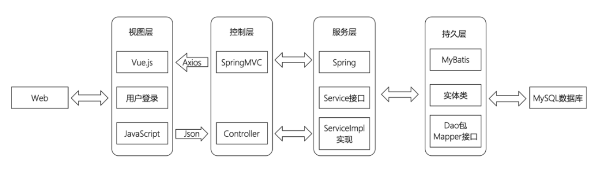

#### 4.1.2 系统功能板块

[图片：图 4-2 系统功能模块图]
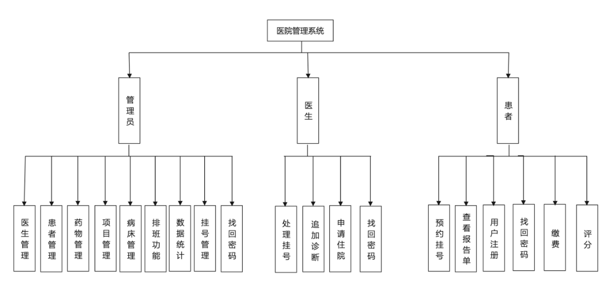

### 4.2 ER 图 - 数据库概要设计

  * **管理员实体** ：用来存储医院管理员的基本信息，主键是医院管理员 ID。数据来源：系统管理员的录入，修改。
[图片：图 4-3 管理员实体信息属性图]
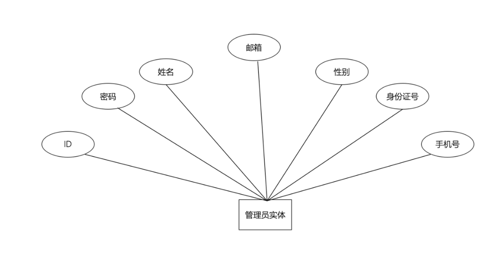
  * **医生实体** ：存储医生的基本信息，医生 ID 为主键。数据来源：管理员的录入，修改。
[图片：图 4-4 医生实体信息属性图]
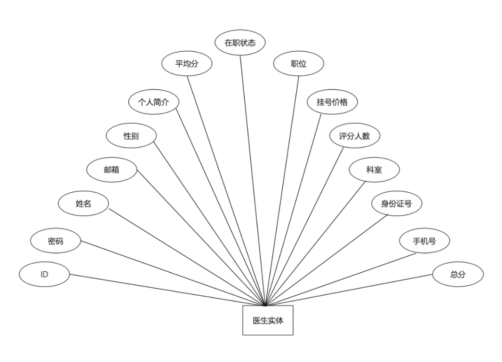
  * **患者实体** ：存储患者的基本信息，患者 ID 为主键。数据来源：患者自行注册。
[图片：图 4-5 患者实体信息属性图]
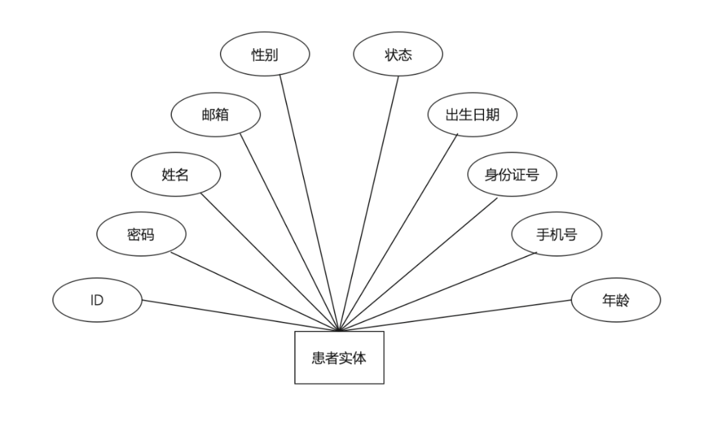
  * **药物实体** ：存储药物的基本信息，药物 ID 为主键。数据来源：管理员的录入，修改。
[图片：图 4-6 药物实体信息属性图]
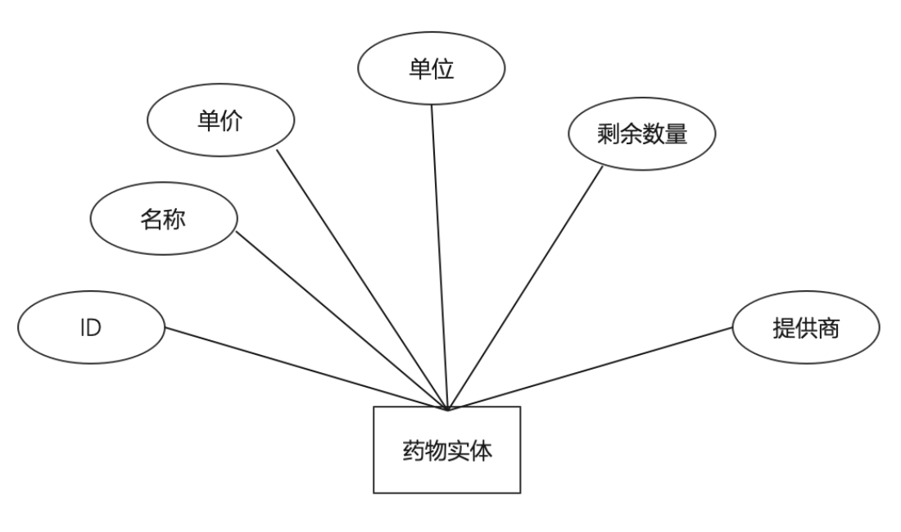
  * **检查项目实体** ：存储检查项目的基本信息，项目 ID 为主键。数据来源：管理员的录入，修改。
[图片：图 4-7 检查项目实体信息属性图]
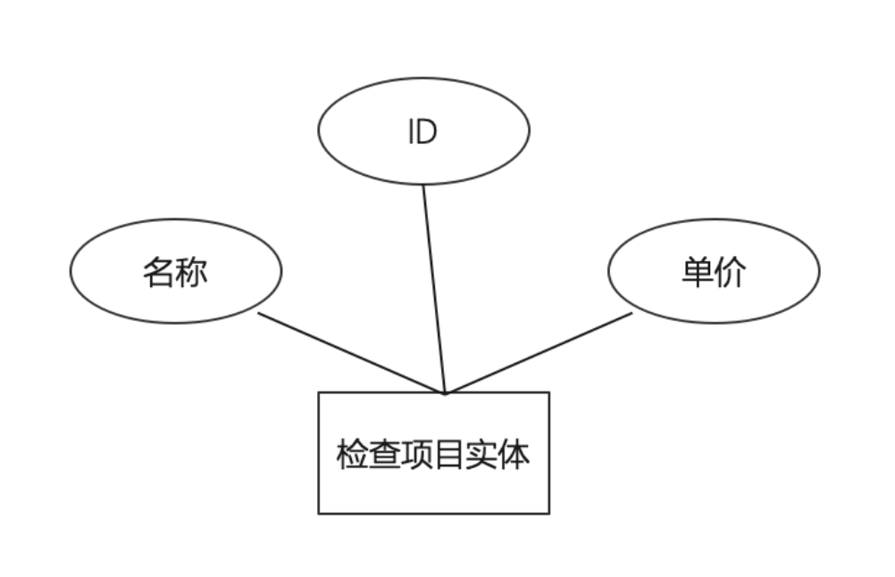
  * **病床实体** ：用来存储医院病床的基本信息，主键是病床 ID，实体的外键是医生 ID 和患者 ID。数据来源：管理员的录入，修改。
[图片：图 4-8 病床实体信息属性图]
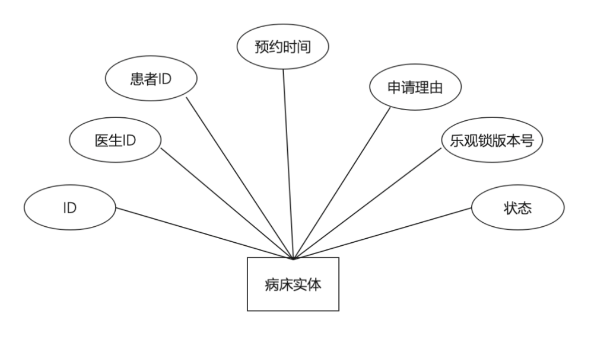
  * **挂号信息** ：存储挂号的基本信息，挂号 ID 为主键，医生 ID 和患者 ID 为外键。数据来源：患者的录入，医生的修改。
[图片：图 4-9 挂号信息属性图]
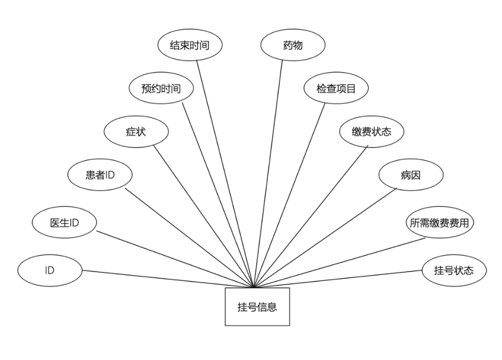
  * **排班信息** ：存储排班的基本信息，排班 ID 为主键，医生 ID 为外键。数据来源：管理员的录入。
[图片：图 4-10 排班信息属性图]
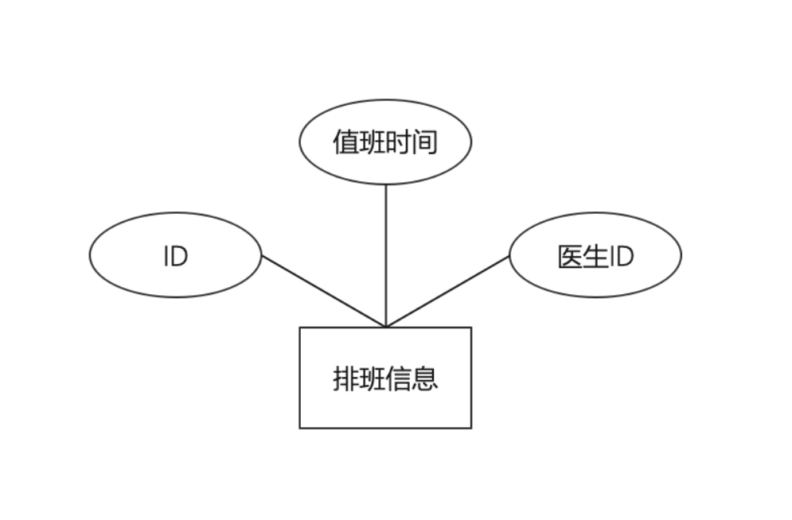

本医院管理系统的数据库共有 8 张表，表与表之间的通过外键建立联系。为了避免数据字段冗余，建立起合理的数据库结构，严格遵循了数据库的设计原则。本系统严格遵循了数据库设计的三大范式，分别为确保每列保持原子性，确保表中的每列都和主键相关以及确保每列都和主键列直接相关。因此本系统的数据库关系是一个结构较为合理的关系型数据库模型。

本系统的 E - R 模型如下图 4 - 11 所示：

[图片：图 4-11 总体 ER 图]
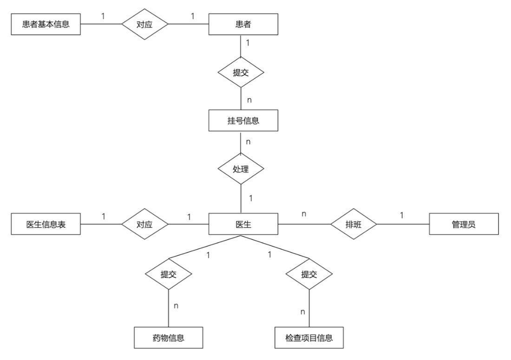

### 4.3 系统后端接口设计

本系统的主要接口如表 4 - 1 所示。

表 4-1 医院管理系统主要接口表

模块| 接口| 请求方式| 作用
---|---|---|---
公共模块| Login| Post| 登录
| findPassword| Get| 找回密码
| sendEmail| Get| 发送邮件
患者信息模块| findAllPatients| Get| 查询所有患者
| deletePatient| Get| 删除患者
| findPatientById| Get| 根据 ID 查询患者
| addPatient| Get| 增加患者
| patientAge| Get| 统计患者男女人数
医生信息模块| findAllDoctors| Get| 查询所有医生
| findDoctor| Get| 根据 ID 查询医生
| addDoctor| Get| 增加医生
| deleteDoctor| Get| 删除医生
| modifyDoctor| Get| 修改医生信息
| findDoctorBySection| Get| 根据科室查询所有医生
| updateStar| Get| 更新用户评分
| uploadExcel| Get| 批量导入医生信息
| downloadExcel| Get| 批量导出医生信息
挂号信息模块| findAllOrders| Get| 查询所有订单
| deleteOrder| Get| 删除订单
| addOrder| Get| 增加订单
| findOrderByPid| Get| 根据 pId 查询挂号
| findOrderByNull| Get| 查询当天挂号
| updateOrder| Post| 更新挂号信息
| findOrderByDid| Get| 根据 dId 查询挂号
| orderPeople| Get| 统计今天的挂号人数
| orderGender| Get| 统计挂号男女人数
| updateOrderByAdd| Get| 增加诊断及医生意见
| findOrderTime| Get| 查询挂号时间段
| orderSection| Get| 统计过去 20 天某科室挂号人数
排班信息模块| findByTime| Get| 根据日期查询排班信息
| addArrange| Get| 增加排班信息
病床信息模块| findNullBed| Get| 查询所有空床位
| updateBed| Get| 更新床位信息
| findBedByPid| Get| 根据 pId 查询住院信息
| findAllBeds| Get| 查询所有床位信息
| addBed| Get| 增加床位信息
| emptyBed| Get| 清空床位信息
| bedPeople| Get| 统计今天住院人数

## 第 5 章 详细设计

### 5.1 详细功能模块

系统功能模块如表 5 - 1 所示：

表 5-1 系统功能模块

功能| 输入| 处理| 输出
---|---|---|---
登录| 管理员账号 / 医生账号 / 患者账号、密码| 查询数据库中对应的管理员 / 医生 / 患者信息，匹配则返回 Token，存储到本地 localStorage 中| 失败：提示错误成功：进入系统页面
信息管理（医生、患者、挂号信息等）| 查询特定用户信息。点击 “修改” 用户按钮。点击 “增加” 用户按钮。点击 “删除” 用户按钮| 从数据库中查询相应的用户信息。更新数据库中该用户的信息。新增数据库中该角色的信息。删除数据库中该用户的信息。| 跳回到当前用户信息列表首页
排班安排| 点击排班日期。选择排班科室。对该科室的医生进行排班。| 把排班日期存储到本地 localStorage 中。根据排班科室在数据库中查询出该科室的所有医生。将排班日期和该医生 ID 存储到 Redis 中，并限制每个时间段的挂号人数为 40 个，再将该信息存储到 MySQL 中。| 该医生已排班：提示 “该医生已排班” 该医生未排班：提示 “已成功排班”
预约挂号| 选择挂号的科室。选择挂号日期。选择挂号时间段。| 根据科室在数据库中找出所有该科室的医生。根据日期和科室查询出该科室该天的排班医生。查询 Redis 数据库，若剩余号源不为零，将剩余号源减 1，最后把挂号信息插入到 MySQL 中。| 成功或者失败都会有相应的提示
处理挂号| 查看当天挂号信息。处理某个挂号信息。| 在 Token 中解析出该医生的 ID，根据该医生 ID 查询出当天所有未处理的挂号信息。根据填写的病因，所开的药物以及所开的检查项目在数据库中更新该挂号信息。| 成功或者失败都会有相应的提示
退出登录| 点击 “退出登录”| 清除本地 localStorage 中的 Token| 退出到登录页面

#### 5.1.1 用户登录模块

用户输入帐号和密码后，传至系统后台进行校验。如果帐号密码不匹配，跳回登录页面。账号密码都匹配的话，后端生成 Token，返回给前端，前端存储到本地 localStorage 中，如图 5 - 1 所示。

[图片：图 5-1 登录时序图]
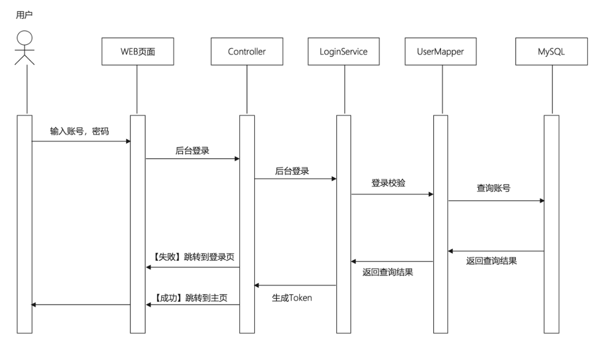

#### 5.1.2 预约挂号模块

患者可以选择科室和日期查询当前科室该日正在值班的医生，接着选择医生和时间段进行挂号，如图 5 - 2 所示。

[图片：图 5-2 预约挂号时序图]
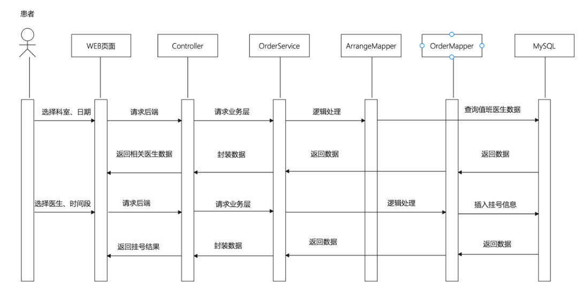

#### 5.1.3 接诊模块

医生根据当天的日期查询所有当天的挂号信息，点击处理按钮，接着可以填写病因，选择药物以及检查项目，更新挂号信息，如图 5 - 3 所示。

[图片：图 5-3 处理挂号时序图]
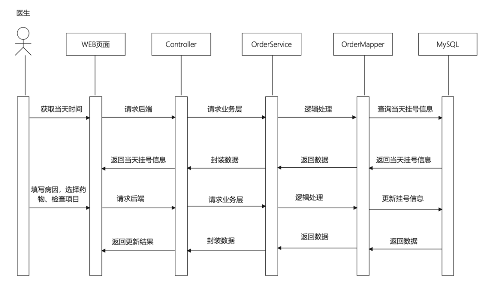

### 5.2 数据库详细设计

在上一章中，已对本系统的实体集进行了概要设计，并设计了实体集之间的 E - R 模型图。在本章节中，从数据库关系的角度出发，设计关系模型以及数据表的逻辑结构。

#### 5.2.1 关系模型设计

根据数据库的概要设计，本小节设计出本系统的关系模型，其中，“主键” 用下划线表示，“外键” 用双下划线表示。

  * 管理员实体（管理员 ID，密码，姓名，性别，身份证号码，手机号，邮箱）
  * 医生实体（医生 ID，密码，姓名，性别，身份证号码，手机号，邮箱，职位，个人简介，所处科室，在职状态，挂号费用，评分人数，总分，平均分）
  * 患者实体（患者 ID，密码，姓名，性别，年龄，身份证号码，手机号，邮箱，患者状态，出生日期）
  * 药物实体（药物 ID，名称，单价，单位，剩余数量，提供商）
  * 病床实体（病床 ID，患者 ID，医生 ID，住院时间，住院原因，病床状态，乐观锁版本号）
  * 检查项目实体（项目 ID，名称，价格）
  * 挂号信息（挂号 ID，患者 ID，医生 ID，症状，预约时间，结束时间，所开药物，所做检查，病因，所需缴费费用，缴费状态，挂号状态）
  * 值班信息（值班 ID，值班时间，医生 ID）

#### 5.2.2 逻辑结构设计

表 5-2：admin (管理员)

属性| 类型| 键| 备注
---|---|---|---
a_id| int| 主键| 账号
a_password| varchar|  | 密码
a_name| varchar|  | 姓名
a_gender| varchar|  | 性别
a_card| varchar|  | 身份证号
a_phone| varchar|  | 手机号
a_email| varchar|  | 邮箱

表 5-3：patient (患者)

属性| 类型| 键| 备注
---|---|---|---
p_id| int| 主键| 账号
p_password| varchar|  | 密码
p_name| varchar|  | 姓名
p_gender| varchar|  | 性别
p_birthday| varchar|  | 出生日期
p_age| int|  | 年龄
p_phone| varchar|  | 电话
p_card| varchar|  | 身份证
p_email| varchar|  | 邮箱
p_state| int|  | 状态

表 5-4：doctor (医生)

属性| 类型| 键| 备注
---|---|---|---
d_id| int| 主键| 账号
d_password| varchar|  | 密码
d_name| varchar|  | 姓名
d_gender| varchar|  | 性别
d_phone| varchar|  | 电话
d_card| varchar|  | 身份证
d_email| varchar|  | 邮箱
d_post| varchar|  | 职位
d_introduction| varchar|  | 简介
d_section| varchar|  | 科室
d_state| int|  | 状态
d_price| decimal|  | 挂号价格
d_people| int|  | 评分人数
d_star| decimal|  | 总分
d_avg_star| decimal|  | 平均分

表 5-5：orders (挂号)

属性| 类型| 键| 备注
---|---|---|---
o_id| int| 主键| id
p_id| int| 外键| 患者账号
d_id| int| 外键| 医生账号
o_record| varchar|  | 病历
o_start| varchar|  | 开始时间
o_end| varchar|  | 结束时间
o_state| int|  | 状态
o_drug| varchar|  | 药物
o_check| varchar|  | 检查项目
o_total_price| decimal|  | 需缴费费用
o_price_state| int|  | 缴费状态
o_advice| varchar|  | 诊断及建议

表 5-6：bed (病床)

属性| 类型| 键| 备注
---|---|---|---
b_id| int| 主键| id
p_id| int| 外键| 患者账号
d_id| int| 外键| 医生账号
b_state| int|  | 状态
b_start| varchar|  | 预约时间
b_reason| varchar|  | 申请理由
version| int|  | 乐观锁版本号

表 5-7：arrange (排班)

属性| 类型| 键| 备注
---|---|---|---
ar_id| int| 主键| id
ar_time| varchar|  | 患者账号
d_id| int| 外键| 医生

表 5-8：drug (药物)

属性| 类型| 键| 备注
---|---|---|---
dr_id| int| 主键| id
dr_name| int|  | 名称
dr_price| int|  | 单价
dr_number| int|  | 剩余数量
dr_unit| varchar|  | 单位
dr_publisher| varchar|  | 提供商

表 5-9：check (检查项目)

属性| 类型| 键| 备注
---|---|---|---
ch_id| int| 主键| id
ch_name| varchar|  | 名称
ch_price| decimal|  | 价格

## 第 6 章 系统实现

本章节展示了公共模块，管理员模块，医生模块以及患者模块的部分功能截图。

### 6.1 登录注册模块

登录页面，用户在浏览器中输入网址后进入到系统的登录页面，用户可以选择角色进行登录，如图 6 - 1 所示。

[图片：图 6-1 登录页面]
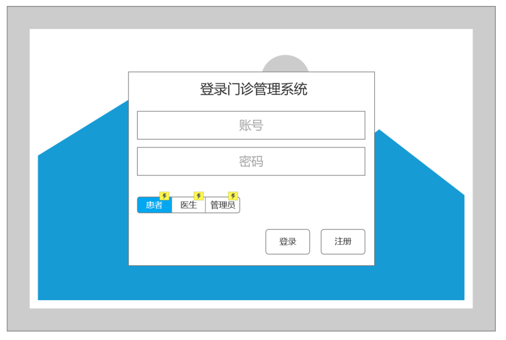

注册模块，用户填写表单可以注册成患者，如图 6 - 2 所示。

[图片：图 6-2 注册界面]
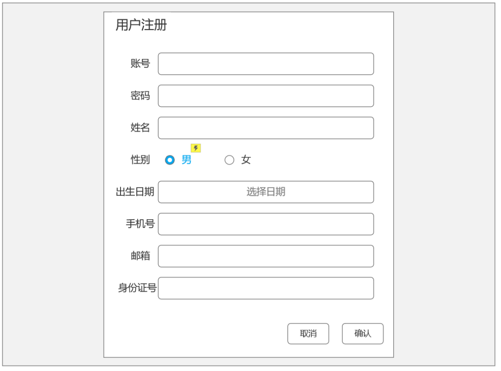

### 6.2 管理员模块

医生信息列表，管理员可以可对医生信息进行增删改查，还支持批量导入和批量导出，如图 6 - 3 所示。

[图片：图 6-3 医生信息管理]
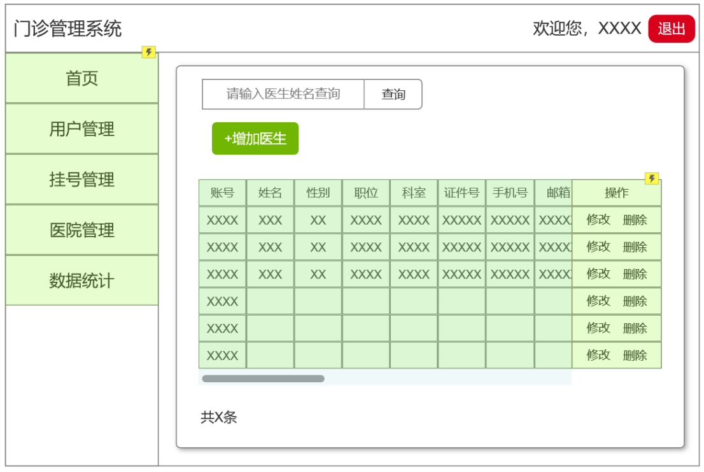

值班安排，管理员首先选择日期，接着选择科室，如图 6 - 4 所示，最后可以选择医生进行排班。

同时还可以进行挂号管理如图 6 - 6 挂号管理，药物管理如图 6 - 7，项目管理如图 6 - 8，床位管理如图 6 - 9，以及对医生的排班管理如图 6 - 10。

[图片：图 6-6 挂号管理]
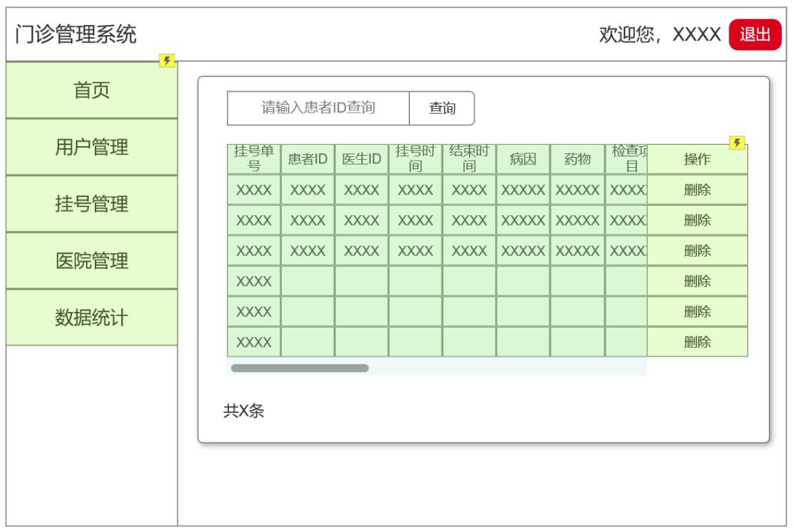

[图片：图 6-7 药物管理]
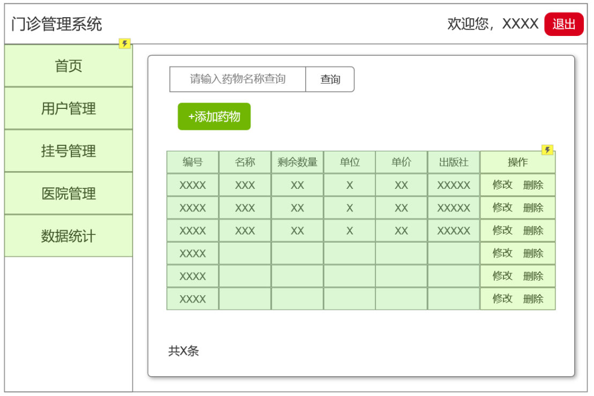

[图片：图 6-8 项目管理]
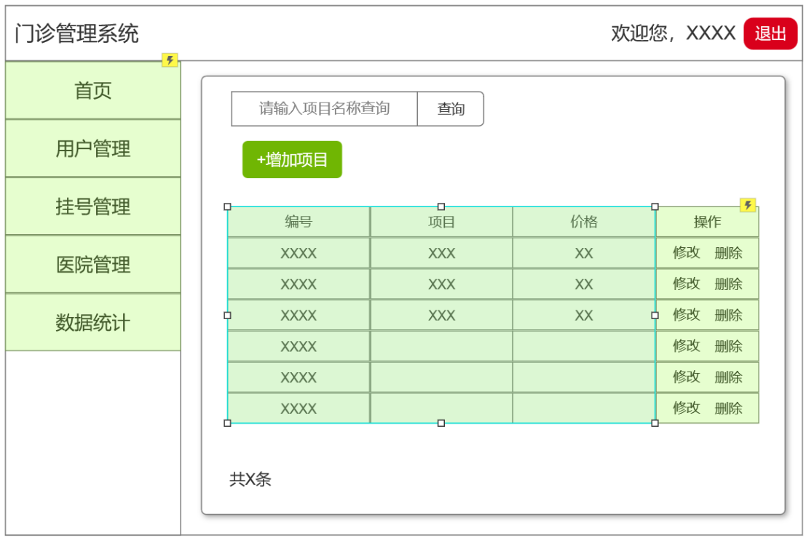

[图片：图 6-9 床位管理]

[图片：图 6-10 排班]
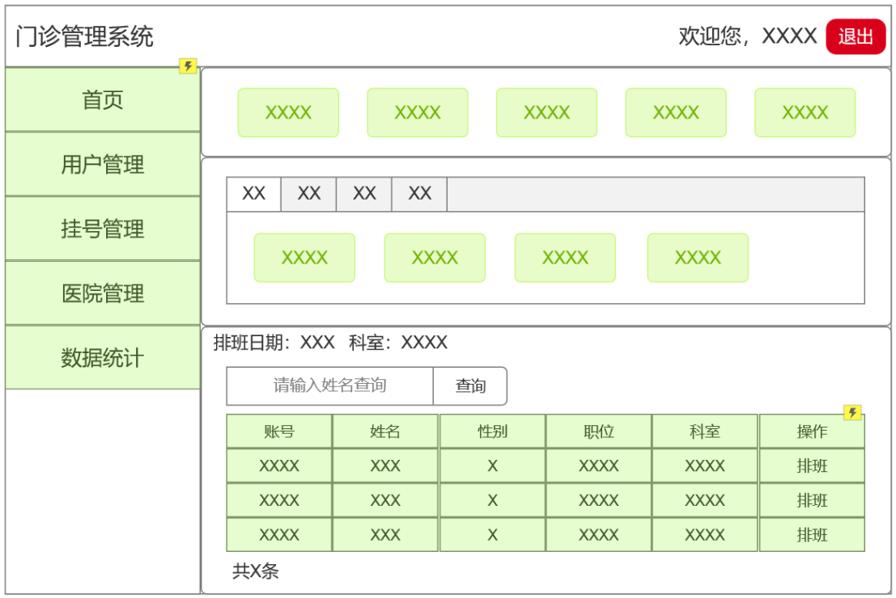

数据统计，管理员可以在此页面中查看有关挂号，患者男女比例等数据统计。

### 6.3 医生模块

医生可以查看当天的挂号信息，并按顺序处理，如图 6 - 7 所示；接着是处理挂号页面，医生可以根据患者的描述，填写相关症状，同时也可开处方药和开检查项目。

[图片：图 6-7 某医生当天挂号列表]
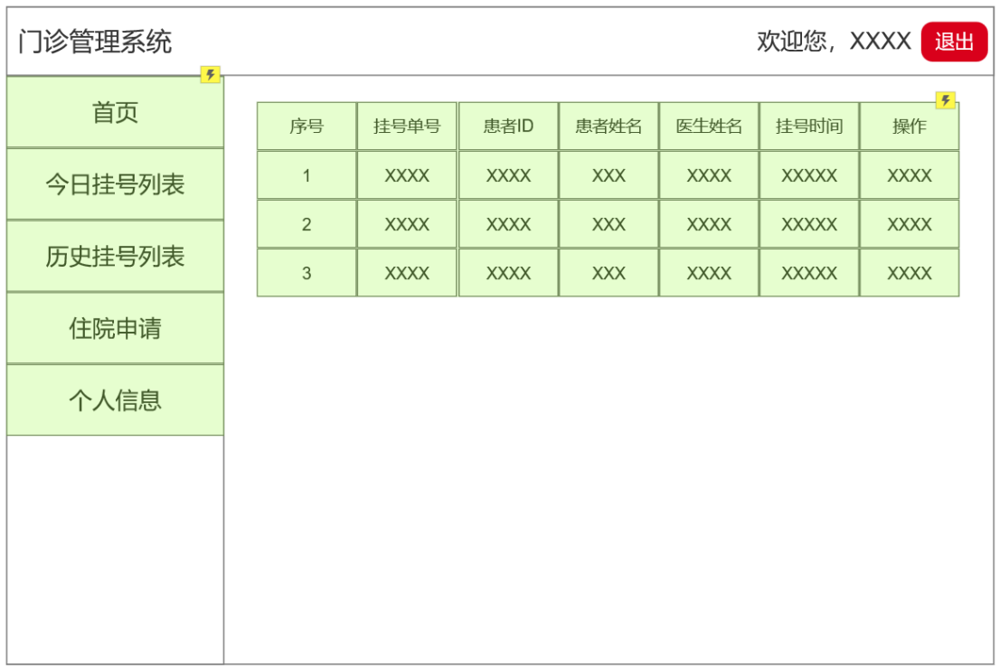

查看挂号，医生可以在此页面查看挂号信息，同时有追加诊断操作。

[图片：图 6-9 医生已经处理的挂号信息列表]
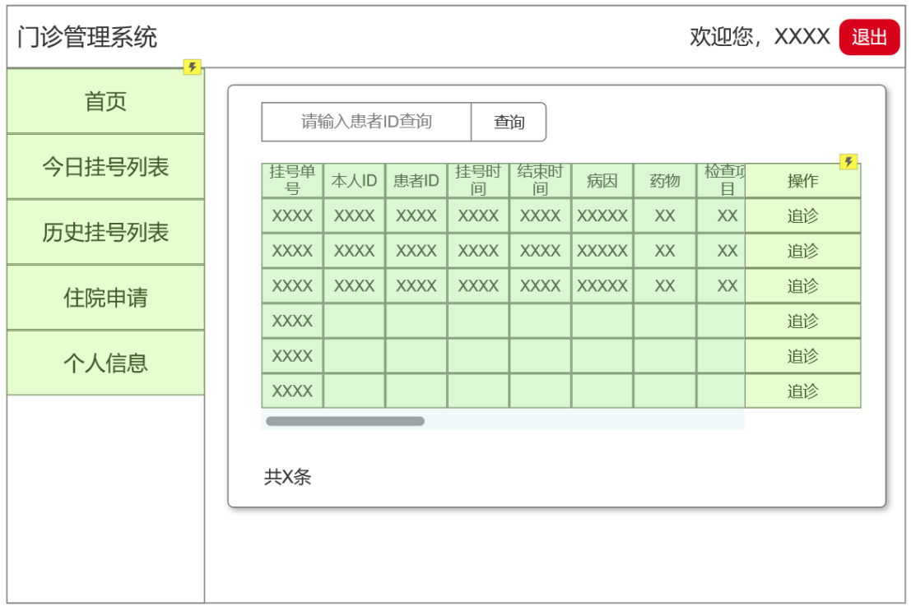

申请当天入院，医生可以根据患者的实际情况，给患者安排当天入院，如图 6 - 10 所示。

[图片：图 6-10 申请当天入院]
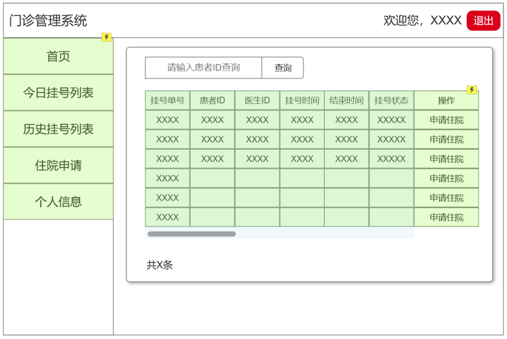

### 6.4 患者模块

预约挂号，患者先选择需要挂号的科室，如图 6 - 11；接着会显示该科室的所有医生信息，患者选择需要挂号的日期，会显示该天值班的医生；患者选择挂号时间段，若有剩余号源，即可成功挂号，可以在我的挂号查看如图 6 - 12。

[图片：图 6-11 选择挂号科室]
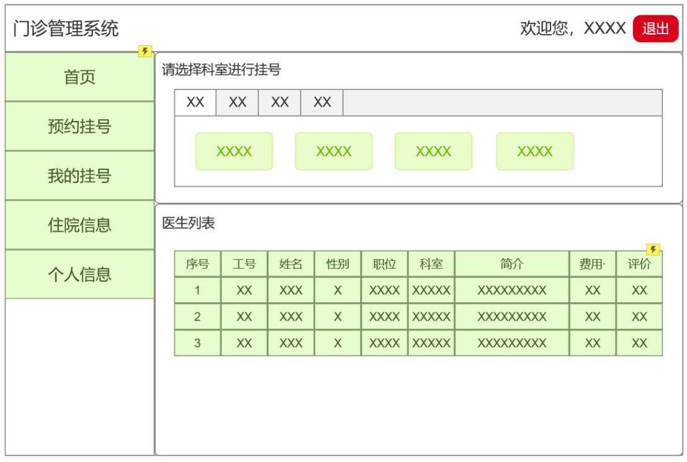

我的挂号，患者可在此页面查看我的挂号相关信息，并且可以在此页面进行缴费和查看 PDF 格式的报告单，如图 6 - 14 所示。

[图片：图 6-14 我的挂号]
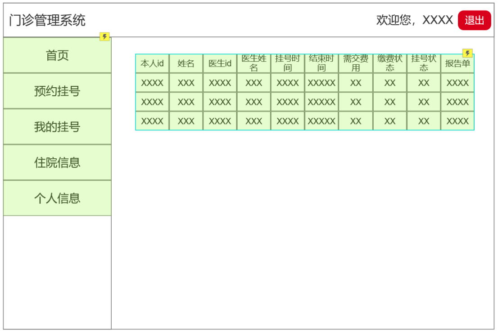

## 第 7 章 系统测试

### 7.1 软硬件环境

操作系统：Windows 10

数据库：MySQL 8.0.19、Redis 3.0.10

应用软件：Idea 2024.1

浏览器：Chrome 90.0.4430.93

### 7.2 测试方法

系统测试是指在完成项目编码后，系统正式上线前，根据系统前期的需求分析以及规格说明进行最终审查。系统测试可以验证系统是否达到需求，每个功能模块是否存在着一些缺陷或错误引发系统不正常的运行，从而保证了系统的准确性与可靠性。

本系统在完成每一个小功能之后，都会进行单元测试，以此来找到存在的 BUG 并解决，同时可以检验功能实现是否达到了预期的效果。在系统完成后使用黑盒方法对本系统进行测试。

### 7.3 测试用例

#### 用户登录测试用例如表 7-1 所示：

表 7-1 用户登录测试用例

编号| 用例名| 预期结果| 实际结果
---|---|---|---
CS0101| 输入正确的账号和密码| 登录成功，进入用户角色首页| 登录成功，进入用户角色首页
CS0102| 输入错误的账号和正确的密码| 提示账号或者密码错误，不做跳转| 提示账号或者密码错误，不做跳转
CS0103| 输入正确的账号和错误密码| 提示账号或者密码错误，不做跳转| 提示账号或者密码错误，不做跳转
CS0104| 账号和密码均为空| 提示账号或密码不能为空，不做跳转| 提示账号或密码不能为空，不做跳转

#### 用户注册测试用例如表 7-2 所示：

表 7-2 用户注册测试用例

编号| 用例名| 预期结果| 实际结果
---|---|---|---
CS0201| 进入用户注册页面| 显示用户注册页面| 显示用户注册页面
CS0202| 使用不正确的账号或者已存在的账号| 提示该账号不合法或者已被占用| 提示该账号不合法或者已被占用
CS0203| 使用已存在的邮箱| 提示该邮箱已被注册，请重新输入| 提示该邮箱已被注册，请重新输入

#### 找回密码测试用例如表 7-3 所示：

表 7-3 找回密码测试用例

编号| 用例名| 预期结果| 实际结果
---|---|---|---
CS0301| 选择错误的角色，填写错误的邮箱号| 未能接收到验证码| 未能接收到验证码
CS0302| 验证码错误| 提示验证码错误或者已过期| 提示验证码错误或者已过期
CS0303| 验证码超过有效期| 提示验证码错误或者已过期| 提示验证码错误或者已过期
CS0304| 新密码和确认密码不一致| 提示新密码和确认密码不一致| 提示新密码和确认密码不一致

#### 医生信息管理测试用例如表 7-4 所示：

表 7-4 医生信息管理测试用例

编号| 用例名| 预期结果| 实际结果
---|---|---|---
CS0401| 增加医生，填写的账号已存在| 提示该账号已被占用| 提示该账号已被占用
CS0402| 增加医生，输入新增医生信息| 增加成功| 增加成功
CS0403| 点击删除医生信息| 提示此操作将删除该医生信息| 提示此操作将删除该医生信息

#### 医生处理挂号测试用例如表 7-5 所示：

表 7-5 医生处理挂号测试用例

编号| 用例名| 预期结果| 实际结果
---|---|---|---
CS0501| 进入当天挂号页面| 按预约时间段顺序显示挂号信息| 按预约时间段顺序显示挂号信息
CS0502| 药物动态增加| 点击左边列表增加药物按钮，右边列表会实时显示该药物信息和数量| 点击左边列表增加药物按钮，右边列表会实时显示该药物信息和数量
CS0503| 药物动态移除| 点击右边列表移除药物按钮，右边列表该药物数量会减 1，若剩余数量为 0，则完全移除该药物信息| 点击右边列表移除药物按钮，右边列表该药物数量会减 1，若剩余数量为 0，则完全移除该药物信息
CS0504| 进入追加诊断页面| 显示追加诊断页面及操作| 显示追加诊断页面及操作

#### 患者预约挂号测试用例如表 7-6 所示：

表 7-6 患者预约挂号测试用例

编号| 用例名| 预期结果| 实际结果
---|---|---|---
CS0601| 点击科室显示该科室所有医生信息| 显示该科室所有医生信息，但无挂号操作| 显示该科室所有医生信息，但无挂号操作
CS0602| 日期选择| 显示当天该科室排班的医生，并出现挂号操作按钮| 显示当天该科室排班的医生，并出现挂号操作按钮
CS0603| 选择有剩余号源的时间段| 提示挂号成功，随后跳转到我的挂号页面| 提示挂号成功，随后跳转到我的挂号页面
CS0604| 选择无剩余号源的时间段| 提示该时间段已无剩余号源，请重新选择挂号时间段| 提示该时间段已无剩余号源，请重新选择挂号时间段
CS0605| 点击缴费按钮| 所需缴费费用清零，弹出对医生评分对话框| 所需缴费费用清零，弹出对医生评分对话框
CS0606| 点击查看病情报告单按钮| 显示本次挂号的病情报告单 PDF| 显示本次挂号的病情报告单 PDF

#### 值班安排测试用例如表 7-7 所示：

表 7-7 值班安排测试用例

编号| 用例名| 预期结果| 实际结果
---|---|---|---
CS0701| 点击排班日期| 显示所有科室目录，本地 localStorage 会存储所点击的排班日期| 显示所有科室目录，本地 localStorage 会存储所点击的排班日期
CS0702| 点击排班按钮| 若该医生未排班，则提示排班成功；若该医生已排班，则提示该医生已排班| 若该医生未排班，则提示排班成功；若该医生已排班，则提示该医生已排班

#### 退出登录测试用例如表 7-8 所示：

表 7-8 退出登录测试用例

编号| 用例名| 预期结果| 实际结果
---|---|---|---
CS0801| 点击退出登录按钮| 存储到本地 localStorage 的 Token 会被清除掉，返回到登录页面| 存储到本地 localStorage 的 Token 会被清除掉，返回到登录页面
