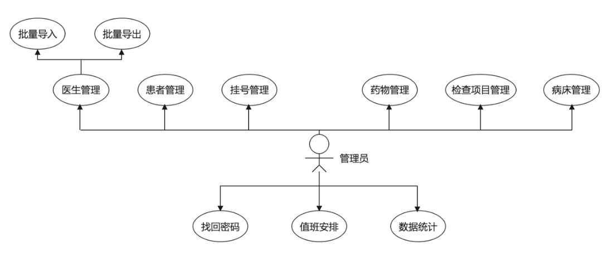
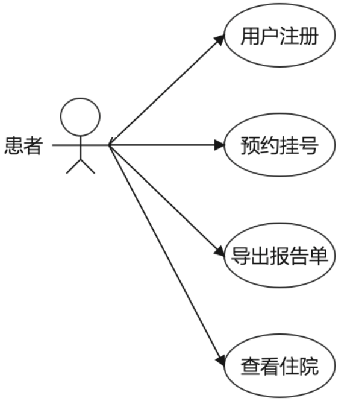

# 详细设计

## 总体设计

### 功能概述

| 功能 | 输入 | 处理 | 输出 |
|--|--|--|--|
| 登录 | 管理员账号/医生账号/患者账号、密码 | 查询数据库中对应的管理员/医生/患者信息，匹配则返回Token，存储到本地localStorage中 | 失败:提示错误成功:进入系统页面 |
| 信息管理（医生、患者、挂号信息等） | 1. 查询特定用户信息。2. 点击“修改”用户按钮。3. 点击“增加”用户按钮。4. 点击“删除”用户按钮 | 1. 从数据库中查询相应的用户信息。2. 更新数据库中该用户的信息。3. 新增数据库中该角色的信息。4. 删除数据库中该用户的信息。 | 跳回到当前用户信息列表首页 |
| 排班安排 | 1. 点击排班日期。2. 选择排班科室。3. 对该科室的医生进行排班。 | 1. 把排班日期存储到本地localStorage中。2. 根据排班科室在数据库中查询出该科室的所有医生。3. 将排班日期和该医生ID存储到Redis中，并限制每个时间段的挂号人数为40个，再将该信息存储到MySQL中。 | 该医生已排班:提示“该医生已排班”该医生未排班：提示“已成功排班” |
| 预约挂号 | 1. 选择挂号的科室。2. 选择挂号日期。3. 选择挂号时间段。 | 1. 根据科室在数据库中找出所有该科室的医生。2. 根据日期和科室查询出该科室该天的排班医生。3. 查询Redis数据库，若剩余号源不为零，将剩余号源减1，最后把挂号信息插入到MySQL中。 | 成功或者失败都会有相应的提示 |
| 处理挂号 | 1. 查看当天挂号信息。2. 处理某个挂号信息。 | 1. 在Token中解析出该医生的ID，根据该医生ID查询出当天所有未处理的挂号信息。2. 根据填写的病因，所开的药物以及所开的检查项目在数据库中更新该挂号信息。 | 成功或者失败都会有相应的提示 |
| 退出登录 | 点击“退出登录” | 清除本地localStorage中的Token | 退出到登录页面 |

## 角色权限模块

整个系统的使用者有三种角色，分别是医院管理员、患者以及医生。以下是三种不同的角色所分别拥有的功能：

### 管理员

管理员可以对医生信息、患者信息、挂号信息、药物信息、检查项目信息进行增删改查操作，可根据日期对医生进行排班操作，同时还可以查看数据的统计信息。

- **医生管理**：
  - 可以通过关键字搜索，分页展示医生信息。
  - 可以增加、删除、修改医生信息。
  - 支持批量导入、批量导出医生信息。

- **患者管理**：
  - 可以通过关键字搜索，分页展示患者信息。
  - 可以删除患者信息。

- **挂号管理**：
  - 可以通过关键字搜索，分页展示挂号信息。
  - 可以删除挂号信息。

- **药物管理**：
  - 可以通过关键字搜索，分页展示药物信息。
  - 可以增加、删除、修改药物信息。

- **检查项目管理**：
  - 可以通过关键字搜索，分页展示检查项目信息。
  - 可以增加、删除、修改项目信息。

- **病床管理**：
  - 可以通过关键字搜索，分页展示病床信息。
  - 可以增加、修改、清空病床信息。

- **找回密码**：支持管理员通过邮件修改密码。

- **值班安排**：可选择从今往后一个月的任一天时间，对医生进行排班。

- **数据统计**：管理员可查看挂号、患者等的数据统计信息。

### 医生

医生可以根据患者的挂号，诊断病因并开处方药以及检查项目，同时还有追加诊断功能，可以根据病人的病情需要申请当天入院。

- **处理挂号**：医生可根据病人的描述，填写症状，还可开处方药和开检查项目。

- **追加诊断**：该功能针对完成检查项目的患者，医生可根据检查报告单填写病因及建议，也可开处方药。

- **申请住院**：医生可根据患者的病情申请住院。

- **查看挂号**：医生可查看所处理患者的挂号信息，包括缴费信息等。

### 患者

患者可以预约当天以及往后七天的挂号，可以自助缴费，完成治疗后可浏览并打印病情报告单，同时也可对就诊医生进行评分。

- **用户注册**：支持新用户注册功能。

- **预约挂号**：患者可以选择科室，选择时间段，选择医生进行预约挂号。

- **导出报告单**：患者可以查看病情报告，并可自助打印病情报告单。

- **查看住院**：患者可通过此功能查看本人的住院信息。

## 后端具体类和接口的详细设计

### 管理员模块

#### 类
- `AdminUserController`
- `AdminUserService`
- `AdminUserServiceImpl`
- `AdminUserMapper`
- `BedController`
- `BedService`
- `BedServiceImpl`
- `BedMapper`
- `CheckController`
- `CheckService`
- `CheckServiceImpl`
- `CheckMapper`

#### 接口及作用
- **管理员登录**: `login` - 实现管理员身份验证。
- **查询医生信息**: `findDoctorPage`, `findDoctor` - 分页查询和按ID查找医生信息。
- **管理医生信息**: `addDoctor`, `deleteDoctor`, `updateDoctor` - 添加、删除和更新医生信息。
- **管理患者信息**: `findAllPatients`, `deletePatient` - 查询所有患者信息和删除患者记录。
- **管理挂号信息**: `findOrdersPages`, `deleteOrder` - 分页查询和删除挂号信息。
- **床位管理**: 
  - `findEmptyBed()`, `findBedByPid()`, `findAllBeds()`, `findBed()`, `updateBed()`, `deleteBed()`, `clearBed()`, `countBed()` - 床位的查询、更新、删除、清空状态以及统计使用情况。
- **检查项目管理**:
  - `findChecksPage()`, `findCheck()`, `addCheck()`, `updateCheck()`, `deleteCheck()` - 检查项目的分页查询、添加、更新、删除。

### 患者模块

#### 类
- `PatientUserController`
- `PatientUserMapper`
- `PatientUserServiceImp`
- `PatientUserService`
- `OrderController`
- `OrderService`
- `OrderServiceImpl`
- `OrderMapper`
- `PdfUtil` (PDF生成工具类)

#### 接口及作用
- **病患登录**: `login` - 实现病患身份验证。
- **查询医生信息**: `findDoctorBySection` - 根据科室查询医生信息。
- **管理病患信息**: `addPatient` - 添加病患信息。
- **挂号单管理**:
  - `addOrder()`, `updateOrder()`, `findOrderByPid()`, `findOrderByDid()`, `findOrderFinish()`, `exportOrderPDF()`, `updatePrice()`, `updateOrderByAdd()`, `findTotalPrice`, `countOrderPeople()`, `countOrderPeopleByDid()`, `countOrderGender()`, `orderSection()`, `findOrderTime()` - 包括添加、更新、查询、导出挂号单，缴费操作，添加诊断及医生意见等。

### 医生模块

#### 类
- `DoctorController`
- `DoctorUserService`
- `DoctorServiceImpl`
- `DoctorUserMapper`
- `DrugController`
- `DrugService`
- `DrugServiceImpl`
- `DrugMapper`

#### 接口及作用
- **医生登录**: `login` - 实现医生身份验证。
- **查看当天挂号**: `findOrderByNull` - 查看医生当天的所有挂号信息。
- **查询患者信息**: `findPatientById` - 根据ID查询患者信息。
- **查询医生信息**: `findDoctorBySectionPage` - 根据科室查询所有医生信息（分页）。
- **评价更新**: `updateStar` - 更新医生评价。
- **药物管理**:
  - `findDrugsPage()`, `findDrug()`, `addDrug()`, `deleteDrug()`, `modifyDrug`, `reduceDrugNumber()` - 药物的分页查询、详情查询、添加、删除、修改以及库存数量减少。
