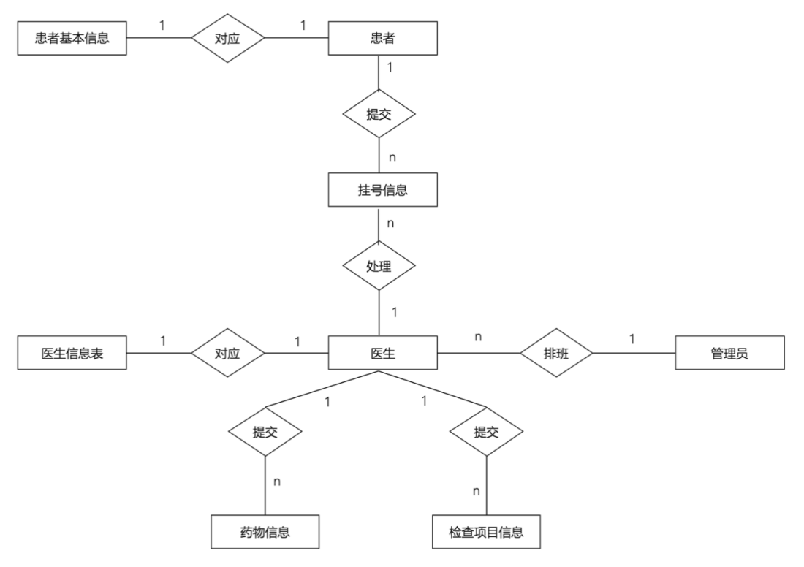

# 门诊管理系统需求分析研究

## 摘要

本需求分析文档针对医院管理系统的设计需求进行了全面的分析，明确了系统所需的功能和性能要求。该系统旨在满足医院内患者、医生和管理人员的不同需求，通过线上预约挂号、病历信息管理、自助缴费等功能，优化医院业务流程。文档从系统的功能需求、数据需求和用户需求等多个角度进行分析，为后续系统开发提供清晰的需求指导。

**关键词**：门诊管理，功能性需求，非功能性需求，需求分析

## 1. 引言

### 1.1 编写目的

本需求分析文档的核心目标是清晰界定医院管理系统的功能特性、性能指标及其他非功能性需求，为接下来的系统设计及开发工作奠定坚实基础。通过深入剖析项目背景、需求起源和技术发展概况，本文档旨在促进项目团队全面把握系统需求，确保开发过程中的顺畅沟通与高效协作。

### 1.2 项目背景

鉴于医疗行业信息化需求的持续膨胀，医院日常运营中的信息处理任务变得愈发复杂，传统的人工管理模式已难以适应高效、便捷的服务标准。患者在就医流程中频繁遭遇排队挂号、费用结算、病历记录等繁琐环节，这不仅降低了患者满意度，还加剧了医院的管理负担。因此，开发一套涵盖预约挂号、病历管理、自助缴费等功能的综合医院管理系统显得尤为迫切，旨在提升医疗服务品质、简化就医流程、优化资源配置。本需求分析文档围绕上述缘由，深入剖析了系统的功能与用户需求，为系统设计的规范性和实施的有效性提供支持。

### 1.3 需求来源

医院管理系统的需求主要植根于对当前医院业务流程的深入调研与分析。通过问卷调查与实地探访，我们明确了系统需涵盖的基本功能模块，如患者的在线预约挂号、自助缴费、病历管理、医生诊断与处方开具，以及医院管理员对医生、患者信息和药品库存的管理。同时，这些需求也基于国内外医疗信息化的发展趋势，旨在满足患者、医生、管理员等不同用户群体的需求，确保系统的实用性和未来扩展能力。

### 1.4 国内外技术现状

国内外医院信息管理系统的发展已历经多年，特别是在欧美等发达国家，医院管理信息化水平较高，普遍采用集成化的信息系统来简化医疗流程，提升医疗资源利用效率。相比之下，国内医院信息管理系统的普及起步较晚，但近年来在国家政策的引导和信息技术进步的推动下，大中型医院逐步建立了HIS（医院信息系统），实现了电子病历管理、诊疗信息共享等功能，推动了医疗信息化的快速发展。

## 2. 需求分析

### 2.1 系统软件环境图

系统边界，即系统包含的功能与系统不包含的功能之间的界限。一般在系统分析阶段定义，只有明确了系统边界，才能继续进行下面的分析、设计等工作。

本系统的交互环境是：在医院管理系统中有三个角色：管理员、医生和患者。这三种角色分别有以下功能：

- **管理员**：首页展示当天的预约挂号人数和住院人数，可对医生信息进行查增、批量导入和批量导出，可对患者、挂号信息进行查删，可对药物、检查项目和病床信息进行增删改查，可对医生进行排班操作，可查看数据统计页面。
- **医生**：首页展示当天本人的预约挂号人数，可对患者进行诊断、开处方药、开检查项目以及追诊操作，可帮患者申请入院，可查看本人诊断的挂号信息。
- **患者**：可预约挂号，可查看本人挂号信息，可查看本人住院信息，可对医生进行评价。

系统边界是：处理挂号、追加诊断、申请住院、查看挂号、预约挂号、导出报告单、查看住院、医生管理、患者管理、挂号管理、药物管理、检查项目管理、病床管理、找回密码、值班安排、数据统计等功能就是本系统要实现的功能。通过管理员、患者、医生三个角色来实现信息的交互。

本系统的业务需求主要是对信息的基本管理、预约挂号和处理挂号等。

## 3. 数据需求

### 3.1 ER图

### 3.2 数据字典

| 名称            | 含义                     | 类型      | 大小      | 格式       | 单位   | 精度       | 取值范围       |
|-----------------|--------------------------|-----------|-----------|------------|--------|------------|----------------|
| a_id            | 管理员账号               | int       | 20Bytes   | 无要求     | 无要求 | 无要求     | 无要求         |
| a_password      | 管理员密码               | varchar   | 40Bytes   | 无要求     | 无要求 | 无要求     | 无要求         |
| a_name          | 管理员姓名               | varchar   | 20Bytes   | 无要求     | 无要求 | 无要求     | 无要求         |
| a_gender        | 管理员性别               | varchar   | 10Bytes   | 无要求     | 无要求 | 无要求     | 男/女          |
| a_card          | 管理员身份证号           | varchar   | 20Bytes   | 无要求     | 无要求 | 无要求     | 18个字符       |
| a_phone         | 管理员手机号             | varchar   | 20Bytes   | 无要求     | 无要求 | 无要求     | 11个字符       |
| a_email         | 管理员邮箱               | varchar   | 50Bytes   | 具有@字符  | 无要求 | 无要求     | 无要求         |
| p_id            | 患者账号                 | int       | 20Bytes   | 无要求     | 无要求 | 无要求     | 无要求         |
| p_password      | 患者密码                 | varchar   | 40Bytes   | 无要求     | 无要求 | 无要求     | 无要求         |
| p_name          | 患者姓名                 | varchar   | 20Bytes   | 无要求     | 无要求 | 无要求     | 无要求         |
| p_gender        | 患者性别                 | varchar   | 10Bytes   | 无要求     | 无要求 | 无要求     | 男/女          |
| p_birthday      | 患者出生日期             | varchar   | 20Bytes   | 以“/”分隔  | 无要求 | 无要求     | 早于或等于当日 |
| p_age           | 患者年龄                 | int       | 10Bytes   | 无要求     | 岁     | 无要求     | 0-200岁        |
| p_phone         | 患者电话                 | varchar   | 20Bytes   | 无要求     | 无要求 | 无要求     | 11个字符       |
| p_card          | 患者身份证               | varchar   | 40Bytes   | 无要求     | 无要求 | 无要求     | 18个字符       |
| p_email         | 患者邮箱                 | varchar   | 20Bytes   | 具有@字符  | 无要求 | 无要求     | 无要求         |
| p_state         | 患者状态                 | int       | 40Bytes   | 无要求     | 无要求 | 无要求     | 无要求         |
| d_id            | 医生账号                 | int       | 20Bytes   | 无要求     | 无要求 | 无要求     | 无要求         |
| d_password      | 医生密码                 | varchar   | 40Bytes   | 无要求     | 无要求 | 无要求     | 无要求         |
| d_name          | 医生姓名                 | varchar   | 20Bytes   | 无要求     | 无要求 | 无要求     | 无要求         |
| d_gender        | 医生性别                 | varchar   | 10Bytes   | 无要求     | 无要求 | 无要求     | 男/女          |
| d_phone         | 医生电话                 | varchar   | 20Bytes   | 无要求     | 无要求 | 无要求     | 11个字符       |
| d_card          | 医生身份证               | varchar   | 20Bytes   | 无要求     | 无要求 | 无要求     | 18个字符       |
| d_email         | 医生邮箱                 | varchar   | 50Bytes   | 具有@字符  | 无要求 | 无要求     | 无要求         |
| d_post          | 医生职位                 | varchar   | 20Bytes   | 无要求     | 无要求 | 无要求     | 无要求         |
| d_introduction  | 医生简介                 | varchar   | 50Bytes   | 无要求     | 无要求 | 无要求     | 无要求         |
| d_section       | 医生科室                 | varchar   | 20Bytes   | 无要求     | 无要求 | 无要求     | 无要求         |
| d_state         | 医生状态                 | int       | 40Bytes   | 无要求     | 无要求 | 无要求     | 无要求         |
| d_price         | 挂号价格                 | decimal   | 10Bytes   | 无要求     | 元     | 无要求     | 无要求         |
| d_people        | 评价该医生的总人数       | int       | 20Bytes   | 无要求     | 个     | 无要求     | 无要求         |
| d_star          | 总分                     | decimal   | 20Bytes   | 无要求     | 星     | 精确到十分位 | 无要求         |
| d_avg_star      | 平均分                   | decimal   | 10Bytes   | 无要求     | 星     | 精确到十分位 | 0.0-5.0        |
| o_id            | 挂号id                   | int       | 10Bytes   | 无要求     | 无要求 | 无要求     | 无要求         |
| o_record        | 病历                     | varchar   | 20Bytes   | 无要求     | 无要求 | 无要求     | 无要求         |
| o_start         | 开始时间                 | varchar   | 30Bytes   | 以“/”分隔  | 无要求 | 无要求     | 早于或等于当日 |
| o_end           | 结束时间                 | varchar   | 30Bytes   | 以“/”分隔  | 无要求 | 无要求     | 早于或等于当日 |
| o_state         | 状态                     | int       | 20Bytes   | 无要求     | 无要求 | 无要求     | 无要求         |
| o_drug          | 药物                     | varchar   | 40Bytes   | 无要求     | 无要求 | 无要求     | 无要求         |
| o_check         | 检查项目                 | varchar   | 20Bytes   | 无要求     | 无要求 | 无要求     | 无要求         |
| o_total_price   | 需缴费费用               | decimal   | 10Bytes   | 无要求     | 元     | 无要求     | 无要求         |
| o_price_state   | 缴费状态                 | int       | 10Bytes   | 无要求     | 无要求 | 无要求     | 缴费/未缴费    |
| o_advice        | 诊断及建议               | varchar   | 50Bytes   | 无要求     | 无要求 | 无要求     | 无要求         |
| b_id            | 病床id                   | int       | 10Bytes   | 无要求     | 无要求 | 无要求     | 无要求         |
| b_state         | 病床状态                 | int       | 40Bytes   | 无要求     | 无要求 | 无要求     | 占用/空闲      |
| b_start         | 预约时间                 | varchar   | 20Bytes   | 以“/”分隔  | 无要求 | 无要求     | 早于或等于当日 |
| b_reason        | 申请理由                 | varchar   | 50Bytes   | 无要求     | 无要求 | 无要求     | 无要求         |
| dr_id           | 药物id                   | int       | 10Bytes   | 无要求     | 无要求 | 无要求     | 无要求         |
| dr_name         | 药物名称                 | varchar   | 20Bytes   | 无要求     | 无要求 | 无要求     | 无要求         |
| dr_price        | 药物单价                 | int       | 20Bytes   | 无要求     | 元     | 无要求     | 无要求         |
| dr_number       | 剩余数量                 | int       | 20Bytes   | 无要求     | 无要求 | 无要求     | 无要求         |
| dr_unit         | 药物单位                 | int       | 10Bytes   | 无要求     | 克/毫升| 无要求     | 无要求         |
| dr_publisher    | 药物提供商               | varchar   | 20Bytes   | 无要求     | 无要求 | 无要求     | 无要求         |
| ch_id           | 检查项目id               | varchar   | 20Bytes   | 无要求     | 无要求 | 无要求     | 无要求         |
| ch_name         | 检查项目名称             | varchar   | 20Bytes   | 无要求     | 无要求 | 无要求     | 无要求         |
| ch_price        | 检查项目价格             | int       | 40Bytes   | 无要求     | 元     | 无要求     | 无要求         |

## 4. 功能性需求

### 4.1 功能划分

1. **管理员**：
   - 可对医生信息、患者信息、挂号信息、药物信息、检查项目信息进行增删改查操作。
   - 可根据日期对医生进行排班操作。
   - 可查看数据的统计信息。

2. **患者**：
   - 可预约当天及往后七天的挂号。
   - 可自助缴费。
   - 可浏览并打印病情报告单。
   - 可对就诊医生进行评分。

3. **医生**：
   - 根据患者的挂号，可诊断病因并开处方药及检查项目。
   - 具有追加诊断功能。
   - 可根据患者病情需要申请当天入院。

### 4.2 功能描述

#### 管理员

1. **医生管理**：
   - 可通过关键字搜索，分页展示医生信息。
   - 可增加、删除、修改医生信息。
   - 支持批量导入、批量导出医生信息。

2. **患者管理**：
   - 可通过关键字搜索，分页展示患者信息。
   - 可删除患者信息。

3. **挂号管理**：
   - 可通过关键字搜索，分页展示挂号信息。
   - 可删除挂号信息。

4. **药物管理**：
   - 可通过关键字搜索，分页展示药物信息。
   - 可增加、删除、修改药物信息。

5. **检查项目管理**：
   - 可通过关键字搜索，分页展示检查项目信息。
   - 可增加、删除、修改项目信息。

6. **病床管理**：
   - 可通过关键字搜索，分页展示病床信息。
   - 可增加、修改、清空病床信息。

7. **找回密码**：
   - 支持管理员通过邮件修改密码。

8. **值班安排**：
   - 可选择从今往后一个月的任一天时间，对医生进行排班。

9. **数据统计**：
   - 可查看挂号、患者等的数据统计信息。

#### 医生

1. **处理挂号**：
   - 医生可根据病人的描述，填写症状，还可开处方药和检查项目。

2. **追加诊断**：
   - 针对完成检查项目的患者，医生可根据检查报告单填写病因及建议，也可开处方药。

3. **申请住院**：
   - 医生可根据患者的病情申请住院。

4. **查看挂号**：
   - 医生可查看所处理患者的挂号信息，包括缴费信息等。

5. **用户注册**：
   - 支持新用户注册功能。

6. **预约挂号**：
   - 患者可以选择科室、选择时间段、选择医生进行预约挂号。

7. **导出报告单**：
   - 患者可以查看病情报告，并可自助打印病情报告单。

8. **查看住院**：
   - 患者可通过此功能查看本人的住院信息。

#### 患者

1. **用户注册**：
   - 支持新用户注册功能。

2. **预约挂号**：
   - 患者可以选择科室、选择时间段、选择医生进行预约挂号。

3. **导出报告单**：
   - 患者可以查看病情报告，并可自助打印病情报告单。

4. **查看住院**：
   - 患者可通过此功能查看本人的住院信息。

### 4.3 用例图

根据本系统的使用者将用户划分为三种角色，分别是医院管理员、医生和患者。进入系统前需要通过账号及密码进行登录，患者若无账号可先注册，医生的账号由管理员统一注册，登录成功后则根据他们的各自的角色进入相应的页面。

### 4.4 活动图

### 4.5 时序图

用户输入账号和密码后，传至系统后台进行校验。如果账号密码不匹配，跳回登录页面。账号密码都匹配的话，后端生成Token，返回给前端，前端存储到本地localStorage中。

患者可以选择科室和日期查询当前科室该日正在值班的医生，接着选择医生和时间段进行挂号。

医生根据当天的日期查询所有当天的挂号信息，点击处理按钮，接着可以填写病因，选择药物以及检查项目，更新挂号信息。

## 5. 非功能性需求

### 5.1 出错处理

出错处理是医院管理系统可靠性的重要组成部分。这些措施有助于减少系统故障对医疗服务的影响，确保患者和医生能够持续使用系统。

1. **错误检测与记录**：
   - 系统必须实时检测并记录所有类型的错误，包括数据库操作失败、网络异常等。

2. **关键错误通知**：
   - 对于关键错误，系统应通过邮件或短信立即通知管理员。

3. **自动恢复机制**：
   - 系统应具备自动恢复机制，如重新执行操作或回滚事务，以保证数据一致性。

### 5.2 兼容性

医院管理系统的兼容性和互操作性需求确保系统能够在不同的技术环境中运行，并与其他系统交换数据。这种灵活性有助于医院维护现有的技术投资，并简化新技术的集成。

- **技术环境兼容性**：
  - 系统应兼容主流操作系统（如Windows Server和Linux）和数据库系统（如MySQL和PostgreSQL）。

### 5.3 可维护性和可支持性

医院管理系统的可维护性和可支持性需求确保系统能够容易地进行维护和升级。此外，系统应支持远程诊断和维护，以减少现场支持的需求。

1. **模块化设计**：
   - 系统应采用模块化设计，便于识别和替换故障组件。

### 5.4 可测试性

医院管理系统的可测试性需求确保系统能够进行全面的测试，以验证其功能和性能。

1. **自动化测试**：
   - 系统应支持自动化测试，覆盖所有功能点，包括单元测试、集成测试和系统测试。这有助于在开发过程中早期发现和修复缺陷，提高系统的可靠性。

2. **测试结果记录与分析**：
   - 测试结果应被记录和分析，以指导后续的优化和改进。

### 5.5 用户体验（UX）需求

医院管理系统的用户体验需求确保系统提供直观、易用的界面和流程。

1. **直观易用界面**：
   - 系统应提供清晰的导航、简洁的操作步骤和直观的反馈，以减少用户的学习曲线。
